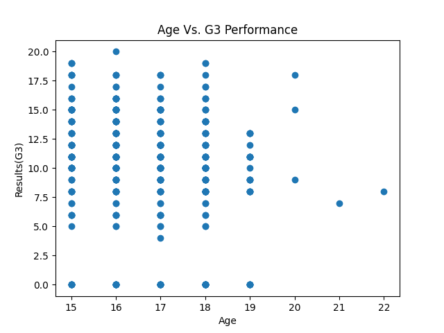

# Student performance tracker

As a learning phase, this project analyses students achievements in portugal schools.

The project will depen dictionary(Python data type) understanding.

## Objectives
- Load students data
- Analyze grades
- Identify top-performing student
- Find least-performing students
- Build a summary of the results

## Structure

Example structure used in this project:

```bash
student_performance_tracker
├── README.md
├── data/
├── notebooks/
├── main.py
├── requirements.txt
├── src/
└── tests/

5 directories, 3 files
```

## Data

The dataset used is downloaded from UCI official source for learning purposes. In this project, it is saved in the `data/` folder as a zip file named: `students+performance.zip`

### Unzip the dataset

To unzip the file use the command below:

```bash
unzip data/students_performance.zip
```
You'll get two files `student+performance.zip` and `student.zip`. We'll go ahead and unzip the student zipped file as shown below:

```bash
unzip student.zip
```

A couple of files shows up but we are interested in `student-mat.csv`.

**Note**: We will be working with `student-math.csv` file for this project.


## Inspect the data

Inside the `01_understanding_data.ipynb` file, we are going to explore some basic properties of the `student-math.csv` file.

### Uncovered
- There are 395 students
- 33 features are included
- No missing values
- Useful features: 
    - Age
    - studytime
    - failures
    - health
    - absences
    - G3 (Final grade)

Useful features will form a matrix $X \in \mathbb{R}^{395 \times 5}$ as $X_i = (Age, studytime, failures, health, absences)$

## Load the data

The `load_data.py` file, get the students data into a dataframe, and convert it to an oriented dictionary.

Example output:

```bash
[
    {'age': 18, 'studytime': 2, 'failures': 0, 'health': 3, 'absences': 6, 'G3': 6}, 
    {'age': 17, 'studytime': 2, 'failures': 0, 'health': 3, 'absences': 4, 'G3': 6}, 
    {'age': 15, 'studytime': 2, 'failures': 3, 'health': 3, 'absences': 10, 'G3': 10}, 
    {'age': 15, 'studytime': 3, 'failures': 0, 'health': 5, 'absences': 2, 'G3': 15}, 
    {'age': 16, 'studytime': 2, 'failures': 0, 'health': 5, 'absences': 4, 'G3': 10}
]

```

How to get the data in a script file:

```python
from src.load_data import load_dataset

data = load_dataset(filepath) 

# Filepath -> Where the file is located
```

How to get the data directly in bash

```bash
python -m tests.load_data_test
```

## Analyze grade

The first plot is about age against the G3 results.

The plot will be save in the `images/` folder. You'll only provide the file name in the `analyzer_test.py` file.

Run the command below to get the age_result plot:

```bash
python -m tests.analyzer_test
```

The resultant plot is as seen below:



As seen, age is not a major grade influencer, although it is noticiable that leaners who are 20 yrs performed lower compared to yonger ones.
## Requirements

This project use the following packages:
- pandas - Loading, cleaning, and understaning data
- matplotlib - Data visualization

Usage:

```bash
pip install -r requirements.txt
```
